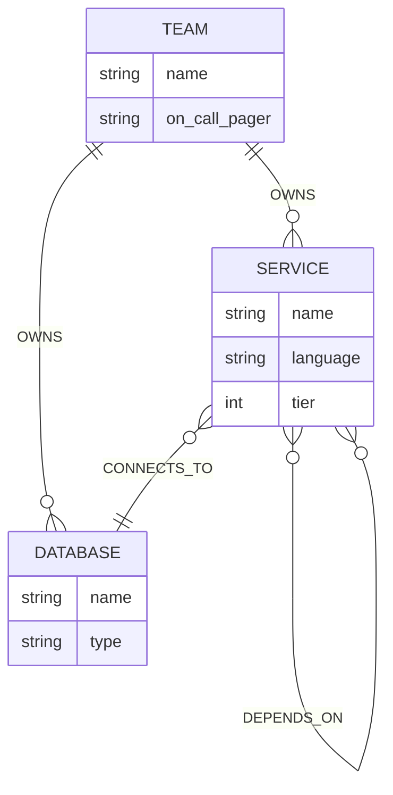
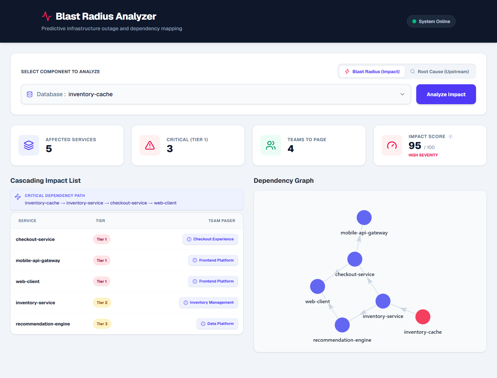
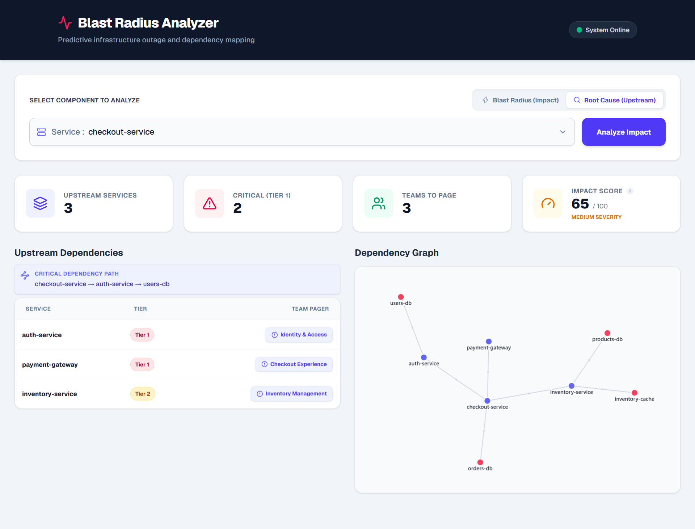

# Blast Radius 💥

Blast Radius is a Graph Database Application built for the Wexa AI Take-Home Assignment. It visualizes and analyzes IT infrastructure dependencies to instantly determine the "blast radius" (impact) of a microservice or database outage.

## The Use Case & Why a Graph Database?

Modern IT infrastructure is a deeply interconnected web of microservices, databases, and owning teams. A critical question during an incident response is: **"If Database X goes down, which services break, and which teams do we need to page?"**

**Why not a Relational Database?**
Finding the blast radius requires traversing upstream dependencies of arbitrary depth (e.g., Service A depends on Service B, which depends on Service C, which uses Database X). Relational databases are notoriously bad at this; they require complex, slow recursive Common Table Expressions (CTEs) or multiple nested `JOIN`s to query hierarchical or network data.

**Why a Graph Database genuinely earns its place:**
In a graph database like CognoDB (Neo4j), this is a native, highly optimized path-traversal query. Nodes represent the entities (Services, Databases, Teams) and relationships represent the dependencies (`DEPENDS_ON`, `CONNECTS_TO`, `OWNS`). Finding the blast radius is as simple as asking the database to walk the relationships up to $N$ hops. 

## Architecture

```text
┌─────────────┐
│   Next.js   │
│  Frontend   │
└──────┬──────┘
       │
       ▼
┌─────────────┐
│ API Routes  │
│ /api/blast  │
└──────┬──────┘
       │ Bolt (TCP)
       ▼
┌─────────────┐
│   CognoDB   │
│ Graph DB    │
└─────────────┘
```

## Design Decisions

**1. Why limit traversals to 4 hops (`*1..4`)?**
The demo limits the graph traversal to four hops to prevent unnecessarily massive result sets while still demonstrating deep, cascading dependency analysis. In a true enterprise production environment, this depth could be user-configurable depending on the size of the microservice topology.

**2. Why use Edge Properties?**
A powerful feature of Graph Databases is storing data on the relationships themselves. By assigning an `is_critical` boolean property to the `DEPENDS_ON` edges, we transform this tool from a simple mapping visualization into a true **resilience analysis tool** capable of detecting Single Points of Failure (SPOF) versus fallback pathways.

**3. Bi-Directional Graph Querying**
This application implements both "Blast Radius" (downstream impact) and "Root Cause" (upstream inspection). This is achieved gracefully by simply flipping the direction of the relationship arrow in the Cypher query (e.g., `<-[:DEPENDS_ON]-` vs `-[:DEPENDS_ON]->`), showcasing the native flexibility of a directed graph.

## Data Model



## Core Cypher Queries Explained

### 1. The Blast Radius Traversal (Awkward for SQL)
This parameterised query simulates a database outage. It finds all services that directly connect to the downed database, and then traverses upstream (`DEPENDS_ON*1..4`) to find all indirectly affected services up to 4 hops away. Finally, it matches the teams that own those affected services so they can be paged.

```cypher
MATCH (db:Database {name: $name})<-[:CONNECTS_TO]-(direct:Service)
OPTIONAL MATCH (direct)<-[:DEPENDS_ON*1..4]-(indirect:Service)
WITH db, collect(distinct direct) + collect(distinct indirect) AS allAffected
UNWIND allAffected AS affected
MATCH (team:Team)-[:OWNS]->(affected)
RETURN affected.name AS service, affected.tier AS tier, team.name AS team, team.on_call_pager AS pager
ORDER BY tier ASC, service ASC
```

### 2. Graph Visualization Extraction
To render the visual node-link diagram on the frontend, we extract the actual paths (nodes and edges) from the graph using a `UNION` query.

```cypher
MATCH path = (db:Database {name: $name})
RETURN path
UNION
MATCH path = (db:Database {name: $name})<-[:CONNECTS_TO]-(:Service)
RETURN path
UNION
MATCH path = (db:Database {name: $name})<-[:CONNECTS_TO]-(:Service)<-[:DEPENDS_ON*1..4]-(:Service)
RETURN path
```

## Setup & Run Instructions

### 1. Provision CognoDB
1. Create a free account at [console.cognodb.com](https://console.cognodb.com/signup).
2. Provision a free (`c0`) instance.
3. Save the Connection URI (`bolt+s://...`) and the generated password.

### 2. Local Setup
Clone this repository and install dependencies:
\`\`\`bash
npm install
\`\`\`

Create a \`.env.local\` file in the root directory and add your credentials:
\`\`\`env
NEO4J_URI=bolt+s://<your-instance-id>.databases.cognodb.cloud
NEO4J_USERNAME=cognodb
NEO4J_PASSWORD=<your_password>
\`\`\`

### 3. Seed the Database
Run the seed script to populate your CognoDB instance with realistic microservice architecture data:
\`\`\`bash
npm run seed
\`\`\`

### 4. Run the Application
\`\`\`bash
npm run dev
\`\`\`
Open [http://localhost:3000](http://localhost:3000) in your browser.

## Screenshots

**Blast Radius Analysis (Downstream Impact)**


**Root Cause Analysis (Upstream Dependencies)**

